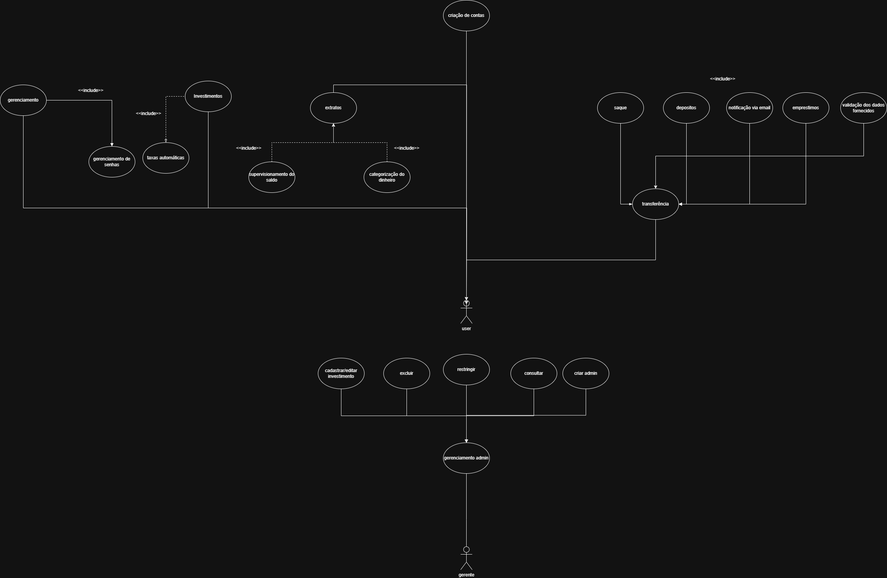
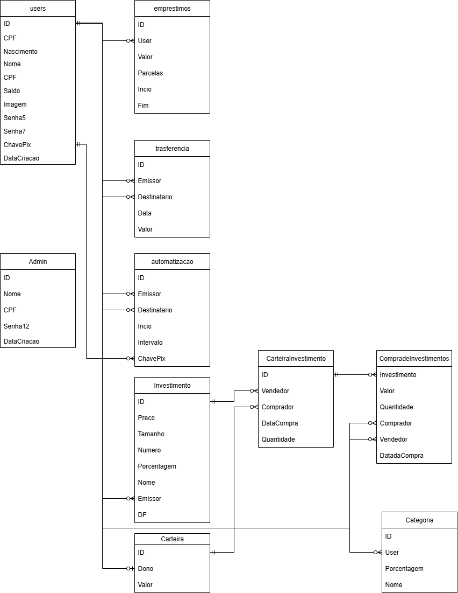

# Nome do Meu Projeto

Projeto Final 2025 do Curso Técnico Integrado de Desenvolvimento de Sistemas - Colégio Pedro II - Campus Duque de Caxias

**Integrantes:**
 - Asafe Domingues Marcelino  (Asafesseidon)
 - João Gabriel Pereira Lopes (João Gabriel Pereira Lopes)
 - Erick Mikael Alhadas Santos (MikaOdayaka)
 - Hytalo Luiz Aguiar Ferreira (IMadeACupcakeCode)

 ## Tecnologias

Este projeto é desenvolvido utilizando  para desenvolvimento da API de backend, SvelteKit como framework frontend e Tailwind como framework CSS.

Em termos de arquitetura de software, este projeto é composto por duas aplicações:
- API/Backend desenvolvida em Node.js com Express
- Aplicação Frontend desenvolvida com Svelte e estilizada com Tailwind

A Aplicação frontend realiza requisições à API utilizando os verbos HTTP, que por sua vez retorna as informações a serem tratadas pela interface. Todo envio e rebimento de informações entre as duas aplicações é realizada utilizando o formato JSON.

Para detalhes técnicos de como executar o projeto consulte o [README da API](src/api/README.md) e [README da Aplicação Frontend](src/frontend-app/README.md). 

## Descrição do Projeto

Nosso TCC se pautará na programamação duas aplicações(frontend e backend) para criar um sistema bancário focado no investimentos em donos de cafezais e circulação de moedas dentro de um bando de digital.
## Documentação

- [Manual do Usuário](manual.md)
- [Requisitos](requisitos.md)
- [Casos de Uso](casos-de-uso.md)
- [Apresentação](apresentacao.pdf)

**Casos de uso**

**Modelagem do Banco de Dados**

