# Manual do Usuário

O projeto CoffeeBank é um banco voltado para o mercado de cultivação de café, especialmente investimentos em cafezais.

**Lista das Funcionalidades:**

 - [Criar uma conta de usuário]
 - [Logar em uma conta de usuário]
 - [Visualizar o saldo de uma conta]
 - [Editar a conta de usuário]
 - [Fazer Transferências]
 - [Visualizar Fundo Imobiliários](usuários)
 - [Fazer Investimentos em Fundo Imobiliários]
 - [Visualizar Investimentos feitos]
 - [Logar em uma conta de administrador]
 - [Visualizar usuários]
 - [Visualizar administradores]
 - [Criar uma conta de administrador]
 - [Excluir usuários]
 - [Criar um Fundo Imobiliário]
 - [Visualizar Fundo Imobiliários](admin)
 - [Editar um Fundo Imobiliário]

 

## Criar uma conta de usuário 

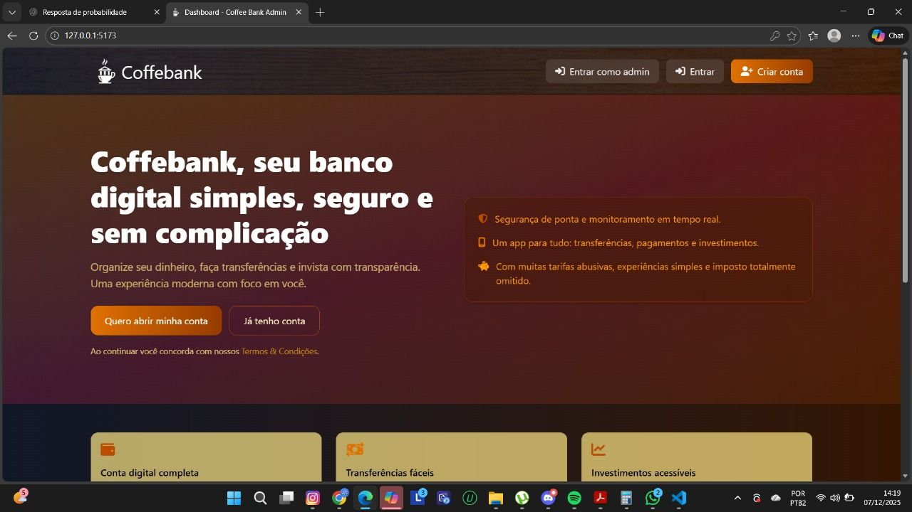

Quando estiver na página de cadastro, o usuário poderá preencher o formulário e clicar no botão "Submit", localizado abaixo dos campos do formulário. Ao realizar tal ação um usuário com as informações providenciadas será criado.

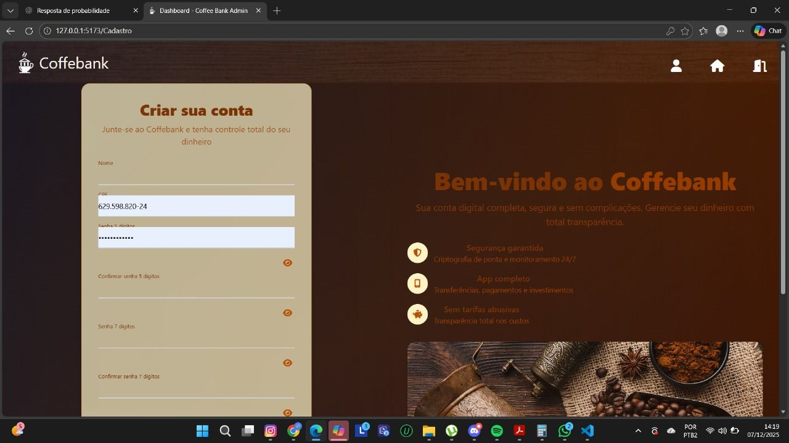

## Logar em uma conta de usuário

Quando estiver na página inicial da aplicação, o usuário poderá clicar no botão "Entrar", localizado no topo da página, nas barras de navegação. Ao realizar tal ação o usuário será redirecionado a página de login, onde terá um formulário exigindo o CPF e senha de 5 digítos da conta que o usuário deseja logar, ao providenciar as informações e apertar o botão "Submit" o usuário será logado e redirecionado a sua página home de usuário.

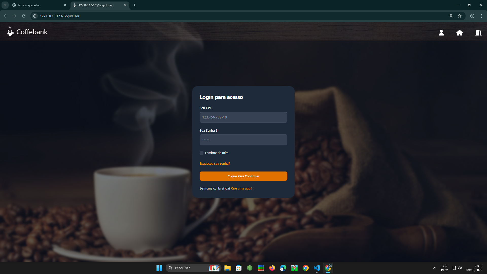

## Visualizar o saldo de uma conta

Quando estiver logado em uma conta de usuário, o usuário poderá clicar no símbolo de olho ao lado de sua imagem de perfil e nome na barra de navegação, fazendo tal ação revelará o saldo na conte do usuário logado.

## Editar a conta de usuário

Quando estiver logado em uma conta de usuário, o usuário poderá clicar na sua foto de perfil ao lado de seu nome e saldo na barra de navegação, fazendo tal ação redirecionará o usuário a página de edição de conta onde haverá um formulário com as informações necessárias para edição da conta e um botão de "Submit", que ao clicar após ter preenchido todas as informações com as novas editará a conta do usuário.

## Fazer Transferências

Quando estiver logado em uma conta de usuário, o usuário poderá clicar no botão "Transferências", ao lado esquerdo do botão "Investimentos", realizando tal ação direcionará o usuário a página de transferências, onde haverá um campo pedindo ovalor da trnasferência e outro exigindo a chave pix do destinatário e um botão chamado "transferir", que ao clicar após ter inserido ás informações nos campos acima, a transferência é realizada.

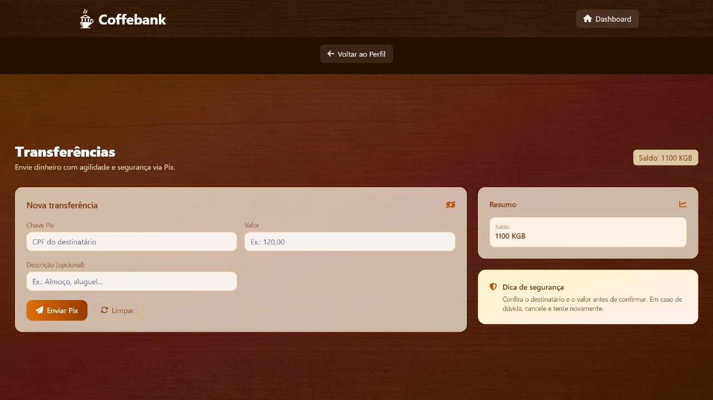

## Visualizar Fundo Imobiliários(usuários)

Quando estiver logado em uma conta de usuário, o usuário poderá clicar no botão "Investimentos", ao lado direito do botão "Transferências", realizando tal ação direcionará o usuário a página de investimentos, onde haverá informações gerais sobre investimentos feitos pelo usuário, além de um botâo com o nome mercado, onde ao clicar redirecionará  o usuário a página de "Mercado de Investimentos", onde está exibido todos os fundos atualmente a venda.

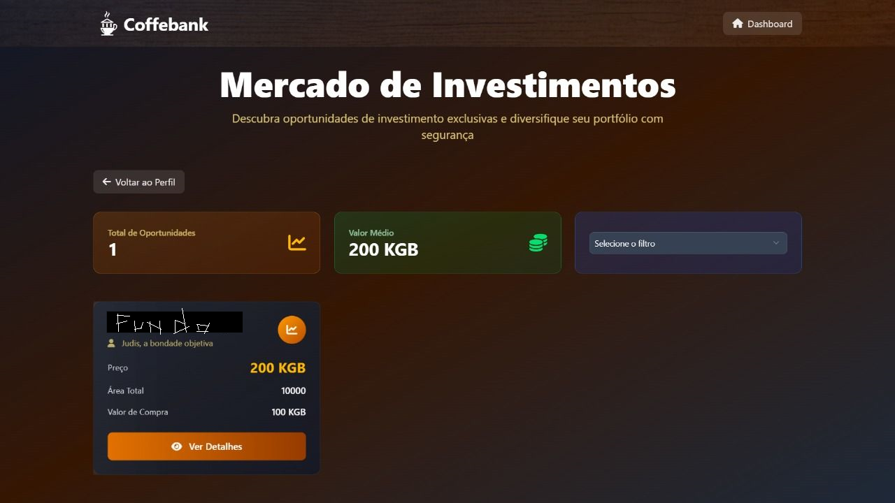

## Fazer Investimentos em Fundo Imobiliários

Quando estiver logado em uma conta de usuário, o usuário poderá clicar no botão "Investimentos", ao lado direito do botão "Transferências", realizando tal ação direcionará o usuário a página de investimentos, onde haverá informações gerais sobre investimentos feitos pelo usuário, além de um botâo com o nome mercado, onde ao clicar redirecionará  o usuário a página de "Mercado de Investimentos", onde está exibido todos os fundos atualmente a venda, ao clicar em um fundo da escolha do usuário, será aberta um modal contendo as informações básicas do fundo e um botão "Investir", que ao clicar redicionará o usuário a página daquele fundo com mais informações do fundo e um campo para senha de 6 dígitos e um botão "Investir", qur ao clicar após preencher a senha realizará o investimento nese fundo.

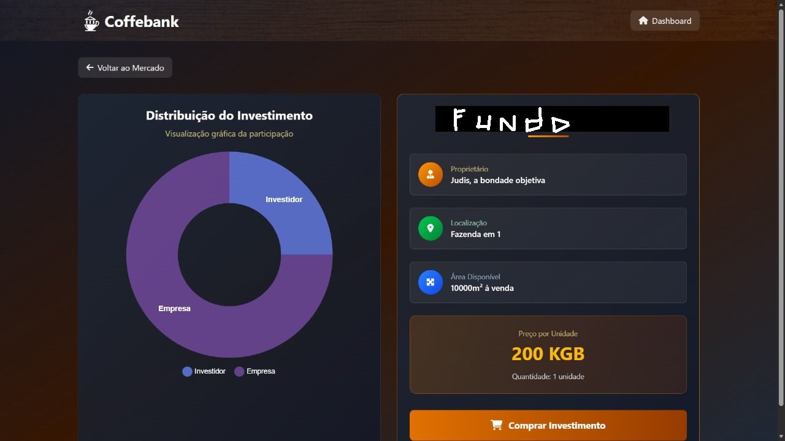

## Visualizar Investimentos feitos

Quando estiver logado em uma conta de usuário, o usuário poderá clicar no botão "Investimentos", ao lado direito do botão "Transferências", realizando tal ação direcionará o usuário a página de investimentos, onde haverá informações gerais sobre investimentos feitos pelo usuário e todos os investimentos feitos por ele.

## Logar em uma conta de administrador

Quando estiver na página inicial da aplicação, o usuário poderá clicar no botão "Entrar como Admin", localizado no topo da página, nas barras de navegação. Ao realizar tal ação o usuário será redirecionado a página de login de administrador, onde terá um formulário exigindo o CPF e senha de 12 digítos da conta de administrador que o usuário deseja logar, ao providenciar as informações e apertar o botão "Submit", o usuário será logado como administrador e redirecionado a página home de admin.

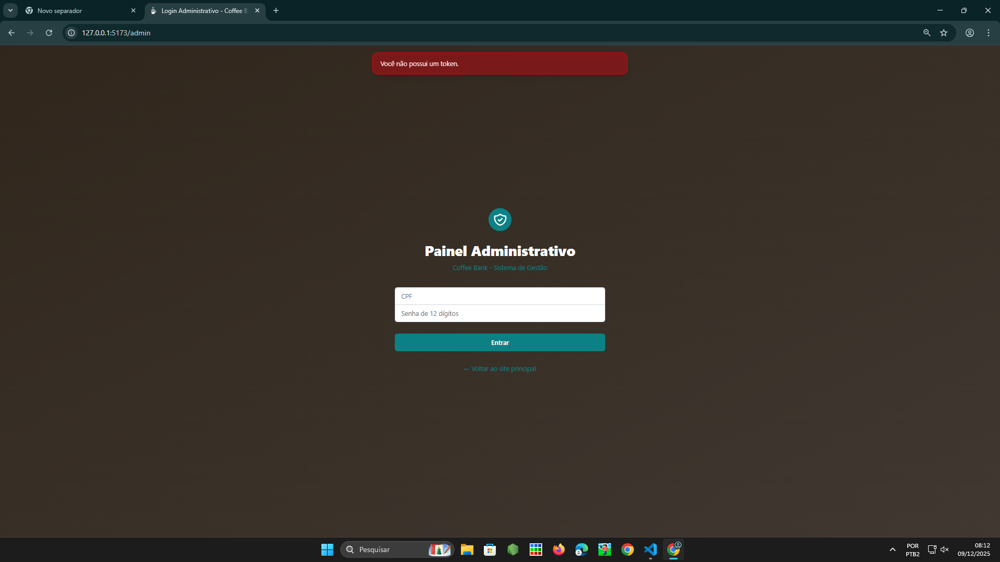

## Visualizar usuários

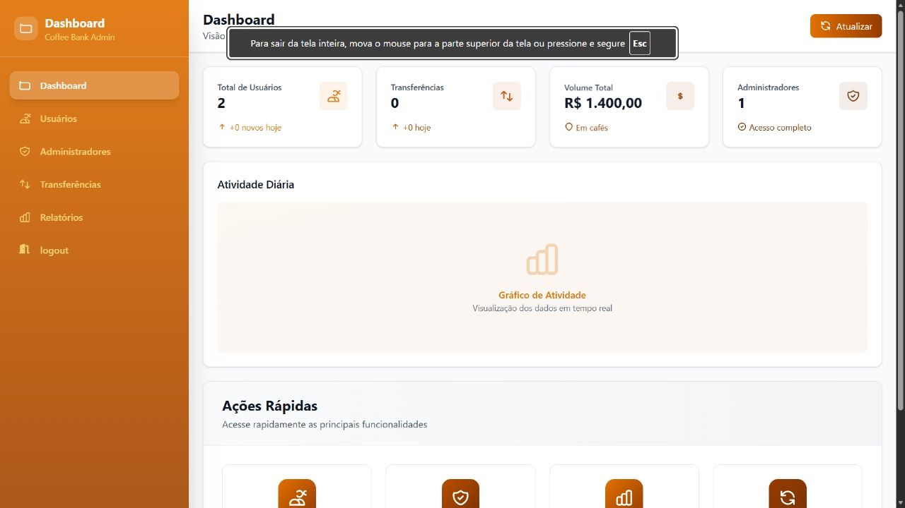

Quando estiver logado como administrador aperte no botão "Usuários" no lado esquerdo da página home de admin, ao clicar o administrador será redirecionado a página de gerenciamento de usuários onde todas as contas de usuário são exibidos.

## Excluir usuários

Quando estiver logado como administrador aperte no botão "Usuários" no lado esquerdo da página home de admin, ao clicar o administrador será redirecionado a página de gerenciamento de usuários onde todas as contas de usuário são exibidos juntamente de um botão de excluir ao lado de cada conta, ao clicar o botão um modal aparecerá para confirmação de deleção de conta de usuário, se confirmar a conta é terminada.

## Criar uma conta de administrador

Quando estiver logado como administrador aperte no botão "Administradores" no lado esquerdo da página home de admin, ao clicar, o administrador será redirecionado a página de administradores onde haverá um dashboard geral com informações dos administradores, além de um botão chamado "Criar Admin" no lado esquerdo da página de administradores, ao clicar o um modal será aberto contendo um campo exigindo um CPF e um botão chamado "Submit", ao apertar o botão após ter inserido o CPF uma conta de admin será criada e sua senha de 12 dígitos criada aleatoriamente será exibida para o administrador anotar.

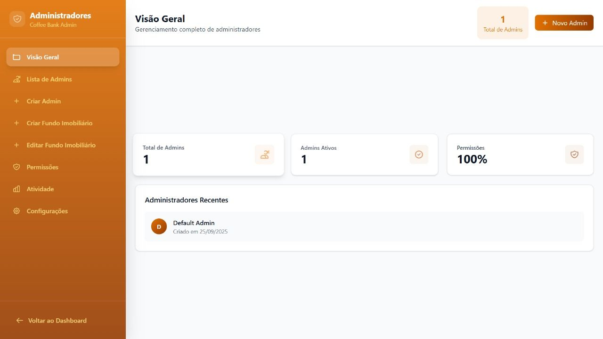
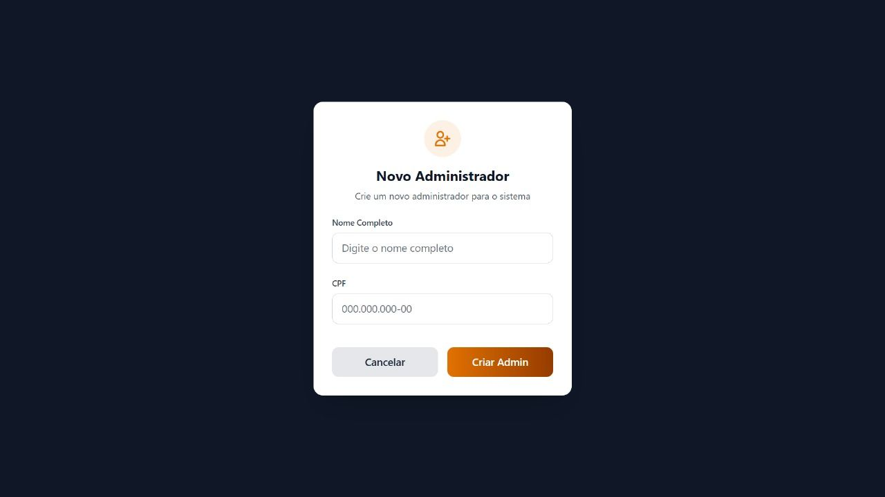

## Visualizar administradores

Quando estiver logado como administrador aperte no botão "Administradores" no lado esquerdo da página home de admin, ao clicar, o administrador será redirecionado a página de administradores onde haverá um dashboard geral com informações dos administradores e um botão do lado esquerdo da página chamado "Lista de Admins", onde ao clicar redicionará o admin a página de lista de Admins, onde são exibidas as contas de cada administrador no sistema.

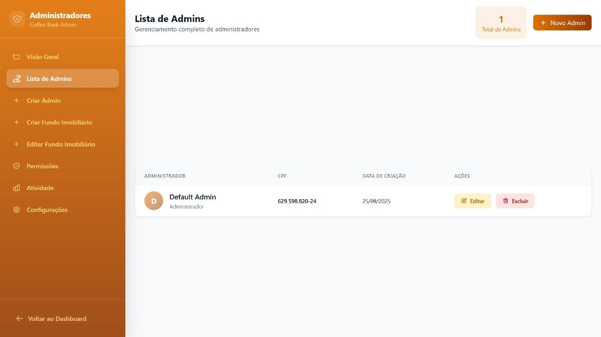

## Excluir administradores

Quando estiver logado como administrador aperte no botão "Administradores" no lado esquerdo da página home de admin, ao clicar, o administrador será redirecionado a página de administradores onde haverá um dashboard geral com informações dos administradores e um botão do lado esquerdo da página chamado "Lista de Admins", onde ao clicar redicionará o admin a página de lista de Admins, onde são exibidas as contas de cada administrador no sistema juntamente com um botão de excluir ao lado de suas respectivas contas, que ao clicar terminará a conta escolhida.

## Criar um Fundo Imobiliário

Quando estiver logado como administrador aperte no botão "Administradores" no lado esquerdo da página home de admin, ao clicar, o administrador será redirecionado a página de administradores onde haverá um dashboard geral com informações dos administradores e um botão do lado esquerdo da página chamado "Criar Fundo", onde ao clicar redicionará o admin a página de criação de Fundo Imobiliários, onde há os campos necessários para criação do fundo e um botão chamado "Submit", que ao clicar após ter preenchido os campos, o sistema criará um fundo imobiliário com às informações fornecidas.

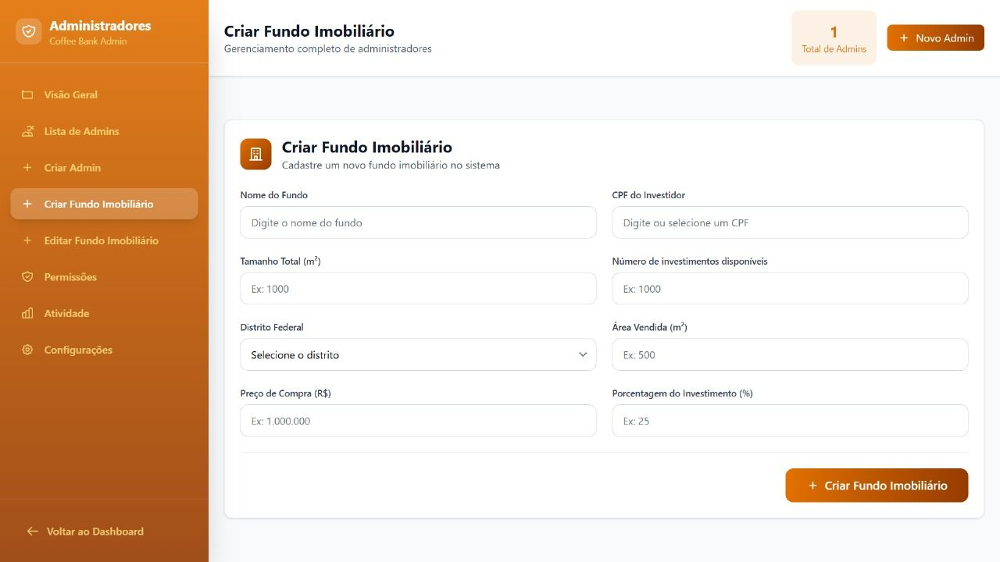

## Visualizar um Fundo Imobiliário(admin)

Quando estiver logado como administrador aperte no botão "Administradores" no lado esquerdo da página home de admin, ao clicar, o administrador será redirecionado a página de administradores onde haverá um dashboard geral com informações dos administradores e um botão do lado esquerdo da página chamado "Criar Fundo", onde ao clicar redicionará o admin a página de criação de Fundo Imobiliários, onde há os campos necessários para criação do fundo e um botão chamado "Submit", que ao clicar após ter preenchido os campos, o sistema criará um fundo imobiliário com às informações fornecidas.

## Editar um Fundo Imobiliário

Quando estiver logado como administrador aperte no botão "Administradores" no lado esquerdo da página home de admin, ao clicar, o administrador será redirecionado a página de administradores onde haverá um dashboard geral com informações dos administradores e um botão do lado esquerdo da página chamado "Editar Fundo", onde ao clicar redicionará o admin a página de edição de Fundo Imobiliários, onde há cada fundo existente no sistema e um botão de editar ao lado dele, que ao clicar abrirá um modal contendo os campos necessários para edição do fundo e um botão chamado "Submit", que ao clicar após ter preenchido os campos, o sistema atualizará o fundo imobiliário escolhido com às informações fornecidas.

## Deletar um Fundo Imobiliário

Quando estiver logado como administrador aperte no botão "Administradores" no lado esquerdo da página home de admin, ao clicar, o administrador será redirecionado a página de administradores onde haverá um dashboard geral com informações dos administradores e um botão do lado esquerdo da página chamado "Criar Fundo", onde ao clicar redicionará o admin a página de criação de Fundo Imobiliários, onde há os campos necessários para criação do fundo e um botão chamado "Submit", que ao clicar após ter preenchido os campos, o sistema criará um fundo imobiliário com às informações fornecidas e um botão de excluir ao lado dos respectivos fundos, que ao clicar terminará aquele fundo e todos os investimentos relacionados.

