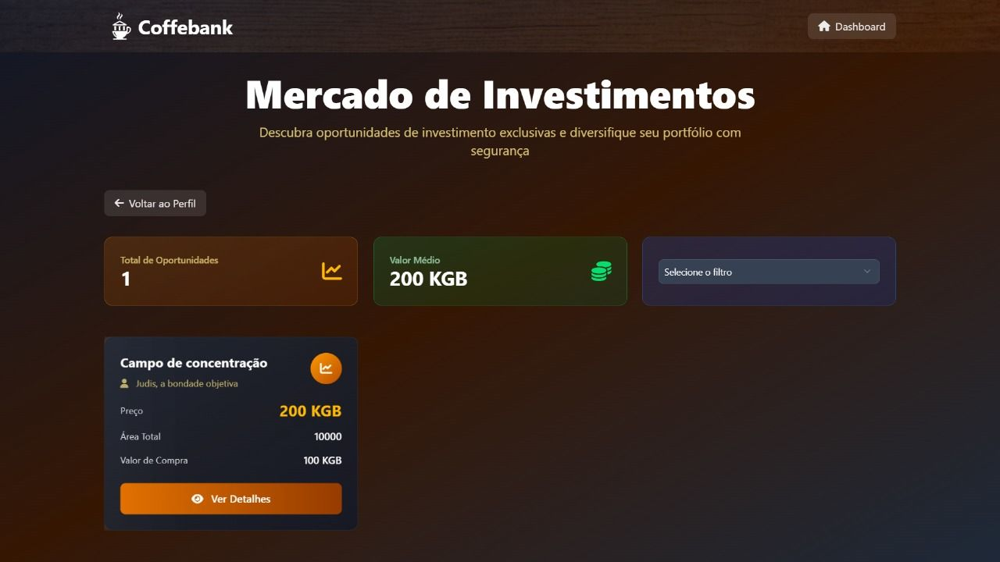
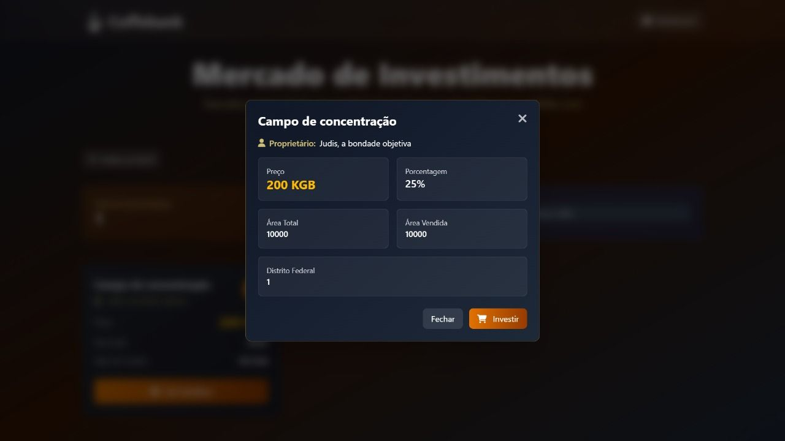
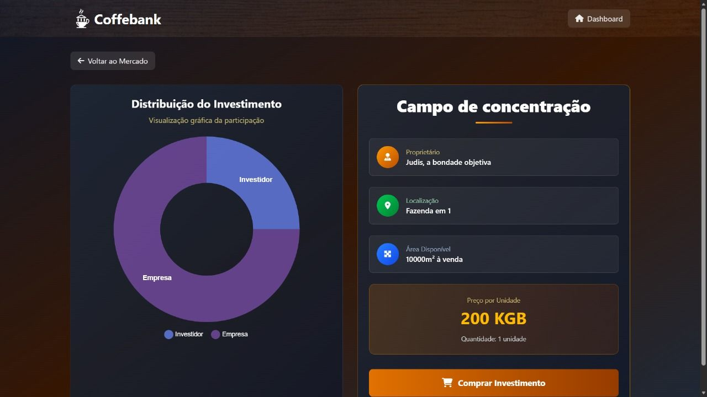

# Manual do Usuário

O projeto CoffeeBank é um banco voltado para o mercado de cultivação de café, especialmente investimentos em cafezais.

**Lista das Funcionalidades:**

 - [Criar uma conta de usuário]
 - [Logar em uma conta de usuário]
 - [Visualizar o saldo de uma conta]
 - [Editar a conta de usuário]
 - [Fazer Transferências]
 - [Visualizar Fundo Imobiliários](usuários)
 - [Fazer Investimentos em Fundo Imobiliários]
 - [Visualizar Investimentos feitos]
 - [Logar em uma conta de administrador]
 - [Visualizar usuários]
 - [Visualizar administradores]
 - [Criar uma conta de administrador]
 - [Excluir usuários]
 - [Criar um Fundo Imobiliário]
  - [Visualizar Fundo Imobiliários](admin)
 - [Editar um Fundo Imobiliário]

 

## Criar uma conta de usuário 

   

   Quando estiver na página de cadastro, o usuário poderá preencher o formulário e clicar no botão "Submit", localizado abaixo dos campos do formulário. Ao realizar tal ação um usuário com as informações providenciadas será criado.

    

## Logar em uma conta de usuário

   

   Quando estiver na página inicial da aplicação, o usuário poderá clicar no botão "Entrar", localizado no topo da página, nas barras de navegação. Ao realizar tal ação o usuário será redirecionado a página de login, onde terá um formulário exigindo o CPF e senha de 5 digítos da conta que o usuário deseja logar, ao providenciar as informações e apertar o botão "Submit" o usuário será logado e redirecionado a sua página home de usuário.

## Visualizar o saldo de uma conta

    
   Quando estiver logado em uma conta de usuário, o usuário poderá clicar no símbolo de olho ao lado de sua imagem de perfil e nome na barra de navegação, fazendo tal ação revelará o saldo na conte do usuário logado.

## Editar a conta de usuário

   Quando estiver logado em uma conta de usuário, o usuário poderá clicar na sua foto de perfil ao lado de seu nome e saldo na barra de navegação, fazendo tal ação redirecionará o usuário a página de edição de conta onde haverá um formulário com as informações necessárias para edição da conta e um botão de "Submit", que ao clicar após ter preenchido todas as informações com as novas editará a conta do usuário.

## Fazer Transferências

    Quando estiver logado em uma conta de usuário, o usuário poderá clicar no botão "Transferências", ao lado esquerdo do botão "Investimentos", realizando tal ação direcionará o usuário a página de transferências, onde haverá um campo pedindo ovalor da trnasferência e outro exigindo a chave pix do destinatário e um botão chamado "transferir", que ao clicar após ter inserido ás informações nos campos acima, a transferência é realizada.

## Visualizar Fundo Imobiliários(usuários)

    Quando estiver logado em uma conta de usuário, o usuário poderá clicar no botão "Investimentos", ao lado direito do botão "Transferências", realizando tal ação direcionará o usuário a página de investimentos, onde haverá informações gerais sobre investimentos feitos pelo usuário, além de um botâo com o nome mercado, onde ao clicar redirecionará  o usuário a página de "Mercado de Investimentos", onde está exibido todos os fundos atualmente a venda.

## Fazer Investimentos em Fundo Imobiliários

    Quando estiver logado em uma conta de usuário, o usuário poderá clicar no botão "Investimentos", ao lado direito do botão "Transferências", realizando tal ação direcionará o usuário a página de investimentos, onde haverá informações gerais sobre investimentos feitos pelo usuário, além de um botâo com o nome mercado, onde ao clicar redirecionará  o usuário a página de "Mercado de Investimentos", onde está exibido todos os fundos atualmente a venda, ao clicar em um fundo da escolha do usuário, será aberta um modal contendo as informações básicas do fundo e um botão "Investir", que ao clicar redicionará o usuário a página daquele fundo com mais informações do fundo e um campo para senha de 6 dígitos e um botão "Investir", qur ao clicar após preencher a senha realizará o investimento nese fundo.

## Visualizar Investimentos feitos

    Quando estiver logado em uma conta de usuário, o usuário poderá clicar no botão "Investimentos", ao lado direito do botão "Transferências", realizando tal ação direcionará o usuário a página de investimentos, onde haverá informações gerais sobre investimentos feitos pelo usuário e todos os investimentos feitos por ele.

## Logar em uma conta de administrador

 

   Quando estiver na página inicial da aplicação, o usuário poderá clicar no botão "Entrar como Admin", localizado no topo da página, nas barras de navegação. Ao realizar tal ação o usuário será redirecionado a página de login de administrador, onde terá um formulário exigindo o CPF e senha de 12 digítos da conta de administrador que o usuário deseja logar, ao providenciar as informações e apertar o botão "Submit", o usuário será logado como administrador e redirecionado a página home de admin.

## Visualizar usuários

## Visualizar administradores

## Criar uma conta de administrador

## Excluir usuários

## Criar um Fundo Imobiliário

## Visualizar um Fundo Imobiliário(admin)

## Editar um Fundo Imobiliário

